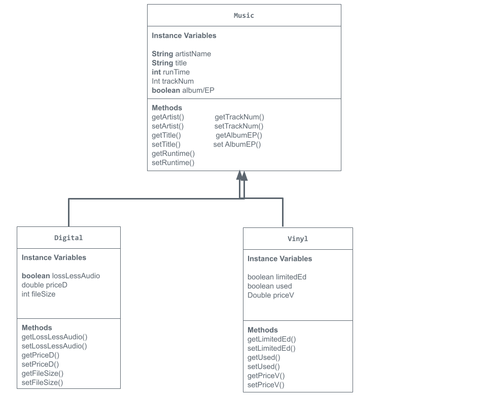

# store-management-project
Project using instance variables, system prints, and toStrings
# Unit 2 - Store Management Project

## Introduction

You are opening a new business in your community! Businesses often need programs to manage the products and services they offer and track orders and requests from customers. Your goal is to create a store management system for your business.

## Requirements

Use your knowledge of object-oriented programming and class structure and design to create your store management system:
- **Create a class hierarchy** – Develop a superclass that represents a product or service your business offers and one or more subclasses that extend the superclass to represent more specific types of products or services.
- **Declare instance variables** – Declare instance variables in the superclass that are shared with the subclasses and instance variables in the subclasses that are not shared with the superclass.
- **Write constructors** – Write no-argument and parameterized constructors in the superclass and subclasses. Subclass constructors use the super keyword to call the superclass constructor.
- **Implement accessor and mutator methods** – Write accessor and mutator methods for instance variables that should be accessible and/or modifiable from outside of the class.
- **Implement a toString() method** – Write toString() methods in the superclass and subclasses that return information about the state of an object.

## UML Diagram

## Description

In this project, I made a store which sells digital music files and vinyl discs. I chose this because of my love of music as well as believing there would be many approaches I could take to creating this. Most of my instance variables were booleans in order to make simplify my code. For my price calculators, I used the accessor method to perform the calculations and the mutator method automatically calls it. Although I do not have user input, because my price variables are calculated and not inputted, my code is fully prepared for user input. In my code I also use 3 constructors rather than 2. A no argument constructor, a 4 argument constructor, and a 5 argument instructor. Because I have the same amount of instance variables in both subclasses these constructors do not overlap

